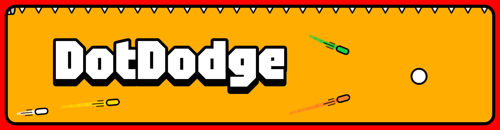
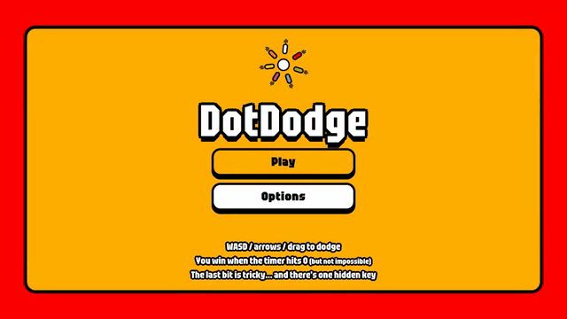

# DotDodge

Dodge seven homing missiles for 120 seconds. My first game, made in 2020, rebuilt for the browser in 2026.

### [Play it on itch.io](https://ahamsel.itch.io/dotdodge)



## How to play

You're the white dot. A blinking arrow on the wall shows where each missile will burst in, and every new one is faster and turns tighter than the last. Survive until the timer hits 0.

- **Move:** WASD or arrow keys. On phones and tablets, drag anywhere to steer.
- **Pause:** Esc or P. **Restart:** R. **Mute:** M.
- Your dot has momentum and bounces off the walls. The last stage adds spikes along the top and bottom, and one hidden key that helps.

## The browser version (`web/`)

TypeScript, Canvas 2D and Vite, with no runtime dependencies. Everything is drawn with shapes, and the sound and music are synthesised in the browser.

```bash
cd web
npm install
npm run dev     # play locally
npm test        # unit tests
npm run itch    # build web/dotdodge.zip for itch.io
```

In the dev server, open `/?watch=75` to start every run 75 seconds in with a dot nothing can catch, handy for checking the late stages.

The preview above is one real run: `web/tools/capture/plan.html` (on the tools server, `npx vite --config tools/vite.config.ts`) searches the actual simulation for inputs that survive all 120 seconds and saves them to `tools/capture/run.json`, and `/?replay=run` makes the game play those inputs step for step.

| Folder | What's in it |
| --- | --- |
| `web/src/game` | The simulation: a fixed 60 Hz step that emits events (pure, unit tested) |
| `web/src/render` | Canvas renderer, effects, trails |
| `web/src/ui`, `web/src/audio`, `web/src/input` | Screens, synthesised sound and music, keyboard and touch |
| `web/tests` | Vitest tests |
| `web/tools` | Generates the store art (cover, banner) with the game's own renderer, and plans the preview run (`tools/capture`) |
| `web/marketing` | itch.io cover, banner, embed background and screenshots |
| `docs/design.md` | The design the rebuild follows |
| `unity/` | The original 2020 Unity project |

## The original (`unity/`)

The 2020 Unity 2019.4 project. Its font and audio were third-party files not licensed for redistribution, so they're left out of this repo; add your own to build it. The Android port lives in [ahamSel/dtddge-android](https://github.com/ahamSel/dtddge-android).

## Credits

Made by ahamsel. The font is [Tektur](https://fonts.google.com/specimen/Tektur) (SIL Open Font License, see `web/public/OFL-Tektur.txt`).
